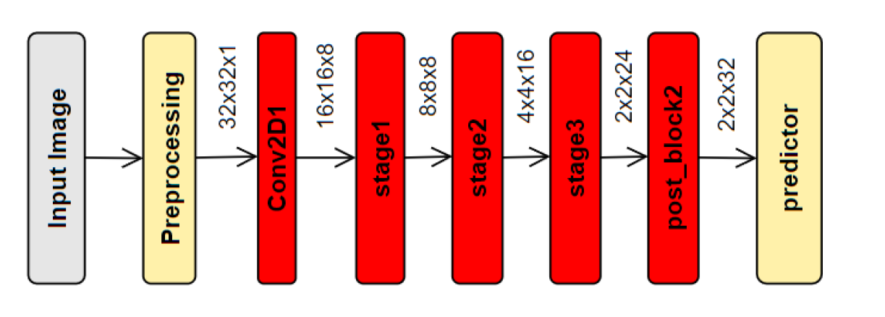
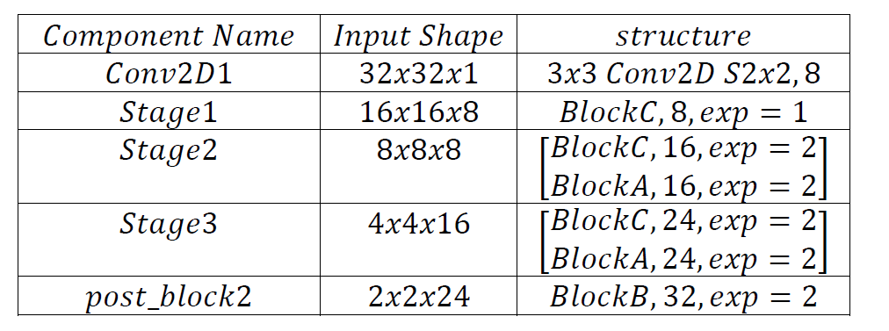
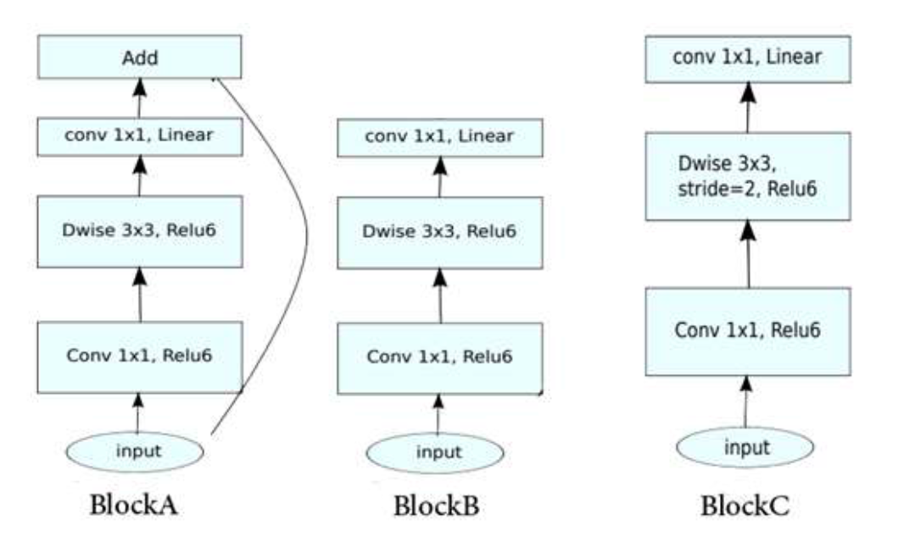

# Binary Classifier

## Goal
this project is a interview task for implementing pre defined architecture :

more details can see in [task.pdf](Task1.pdf)

inference class is [here](code\inference_class.py) and jupyter note book for training is [here](code\RZ_GATA_TASK1.ipynb)

it use **tensorflow**.
